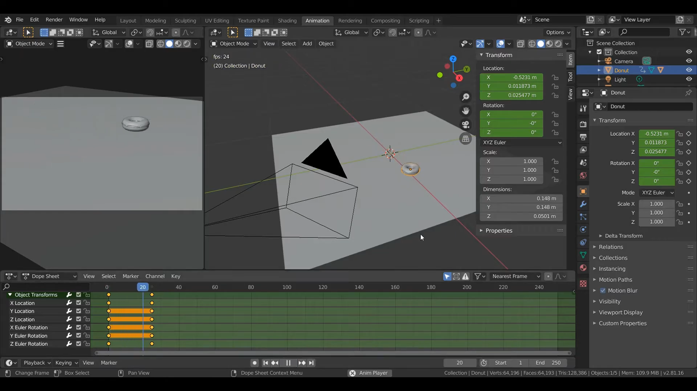
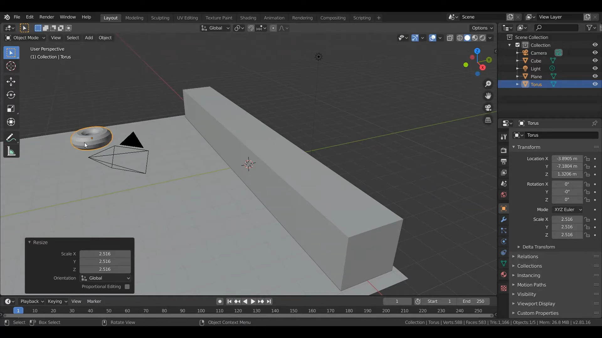
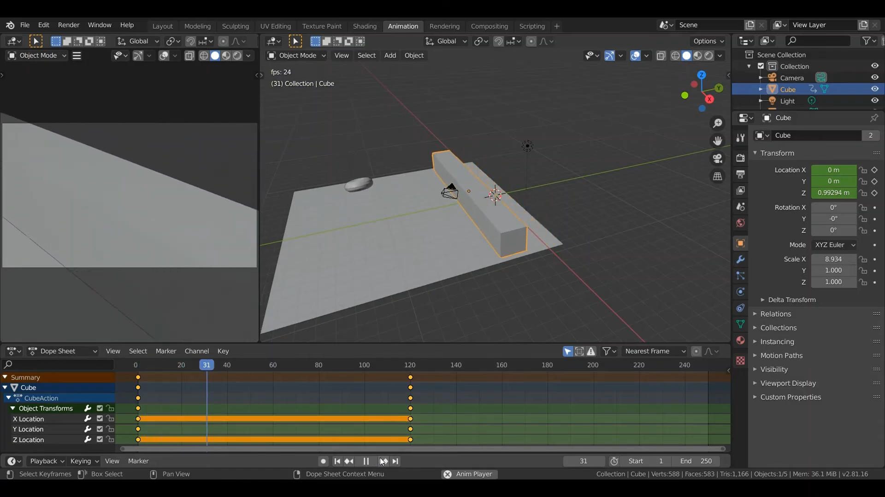
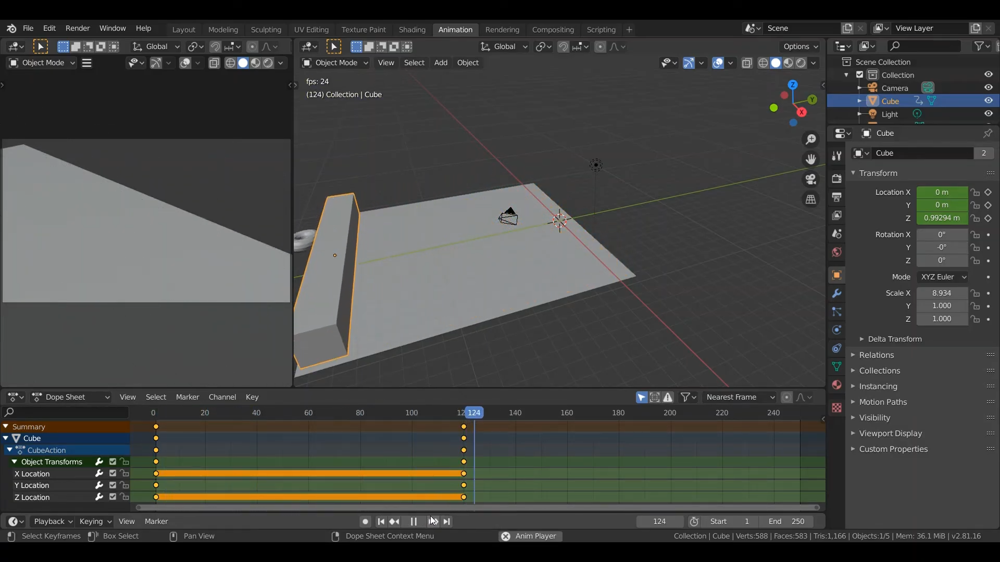
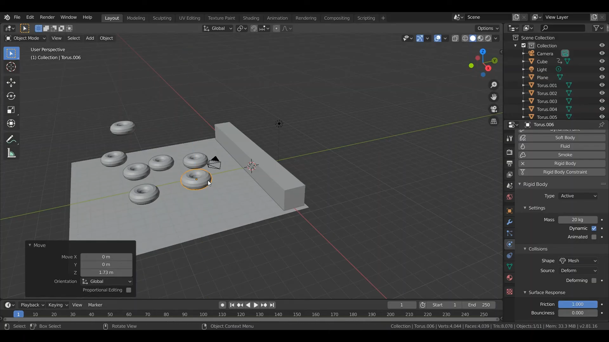
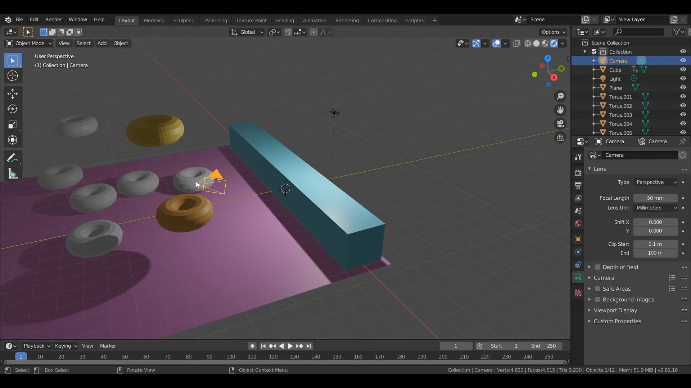
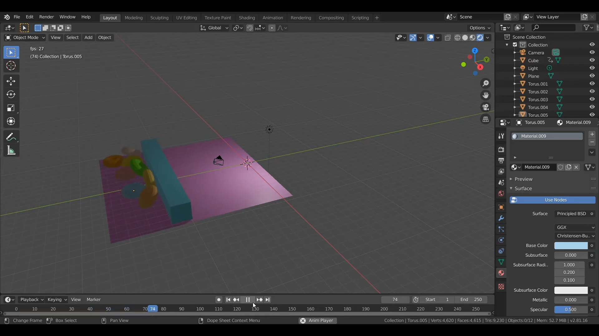
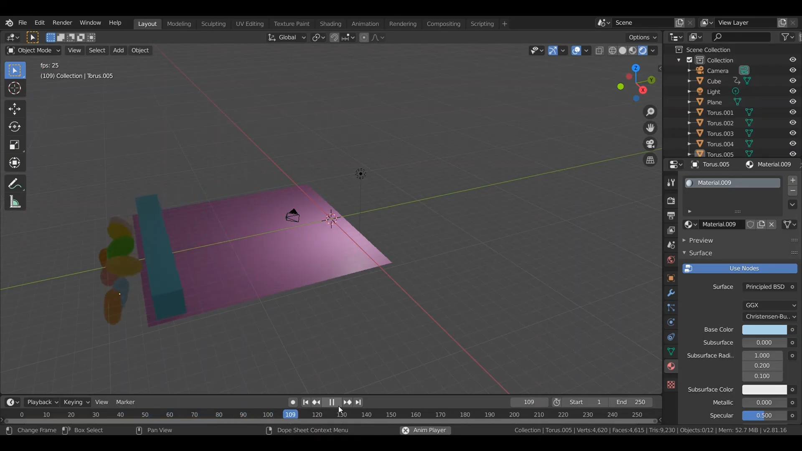

# Animation
&nbsp;&nbsp;&nbsp;&nbsp; การทำให้ object สามารถเคลื่อนไหวได้ตามที่เรากำหนด โดยการสร้างและกำหนด keyframe
 

### Link สำหรับวิดีโอ
link video --> [Click Link](https://youtu.be/QD5_gXUNfg0) 
 
(1) สร้างโดนัทและพื้น จากนั้นทำการไปที่ mode Animation ทำการเพิ่ม keyframe โดยการคลิกที่ object จากนั้นกด I จากนั้นเลือกวิธีการเคลื่อนไหวตามที่เราต้องการ เช่น Location เป็นการขยับตามทิศทางที่เรากำหนด ,  Rotation การหมุนตามองศาที่เรากำหนด โดยการกด N จะขึ้นหน้าต่างให้เรากดปรับค่า X,Y,Z โดยการสร้าง keyframe เราสามารถเลือกเวลาที่จะให้ภาพเคลื่อนไหวได้โดยกดที่แถบด้านล่างก่อนจากนั้นค่อยกด I  
 
 

(2) สร้างองค์ประกอบต่าง ๆ ได้แก่ โดนัท , cube ไว้สำหรับดันโดนัท , พื้นด้านล่าง  
 
 

(3) ทำการกำหนดน้ำหนักของโดนัท และให้โดนัทตกลงมาจากด้านบน และให้กล่อง cube ค่อย ๆ เลื่อนดันโดนัทจนตกลงไปข้างล่าง  
 
 

(4) โดนัทตกลงไปข้างล่างตามแรงโน้มถ่วงที่เรากำหนดไว้  
 
 

(5) ทำการ copy โดนัทให้มีหลาย ๆ อันโดยการกด shift+D แล้วกด G เพื่อจัดตำแหน่ง  
 
 

(6) ทำการกำหนดสีให้ object ต่าง ๆ โดยไปที่เครื่องมือด้านล่างขวาคลิกไปที่แท็บ Materail Properties จากนั้นทำการเลือกสี  Base color และปรับค่าต่าง ๆ  
 
 

(7) ทำการกดเล่น Animation ให้โดนัททั้งหมดตกลงมาที่พื้นแล้วก่อง Cube ค่อย ๆ ดันโดนัทไปเรื่อย ๆ  
 
 

(8) โดนัททั้งหมดค่อย ๆ ตกลงไปด้านล่าง  
 
 
 
[กลับสู่หน้าหลัก](README.md) 
