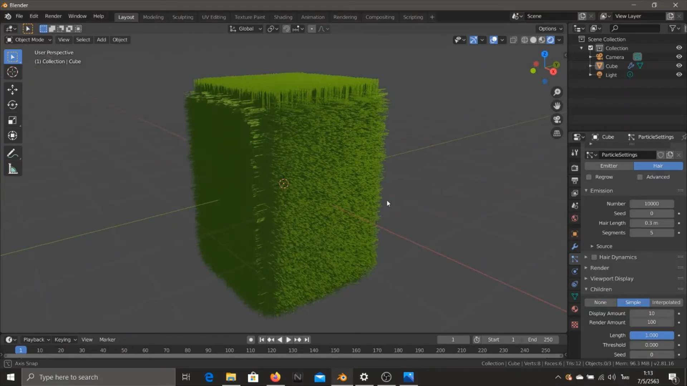

# การสร้างพุ่มไม้ทรงสี่เหลี่ยม
&nbsp;&nbsp;&nbsp;&nbsp; การสร้างพุ่มไม้ทรงสี่เหลี่ยมสำหรับการประกอบฉากโดยใช้เครื่องมือจาก Blender2.8  ด้วยแท็บเครื่องมือที่ชื่อว่า Paticle Properties --> hair ทำการปรับค่าต่าง ๆให้มีความใกล้เคียงกับหญ้าจริง ๆ
 
### Link สำหรับวิดีโอ
link video --> [Click Link](https://youtu.be/wK4aYbDecgw) 
 
(1) ทำการสร้าง cube และทำการปรับขนาดตามที่ต้องการจากนั้นไปที่แท็บเครื่องมือด้านขวาล่าง แถบ Paticle Properties จากนั้นทำการเปลี่ยน Emitter --> Hair ทำการปรับค่า number (จำนวนใบไม้ที่ออกจากพุ่ม) และ hair lenght (ความยาวของใบไม้ที่ปกคลุม) จากนั้นไปที่หัวข้อ Childen เลือกแถบที่ 2 หรือ 3 ก็ได้ จากนั้นทำการปรับค่าต่าง ๆ ตามในคลิปด้านบน  
 
 

(2) ทำการปรับค่าจนกว่าจะได้รูปทรงตามที่เราต้องการ  
 
 

(3) ทำการเปลี่ยนสีของ Object โดยไปที่แถบเครื่องมือด้านความล่างเลือกไปที่แถบ Meterail Properties จากนั้นทำการปรับ Base color และค่าต่าง ๆ ตามที่เราต้องการ  
 
 
</img>
 
[กลับสู่หน้าหลัก](README.md) 
