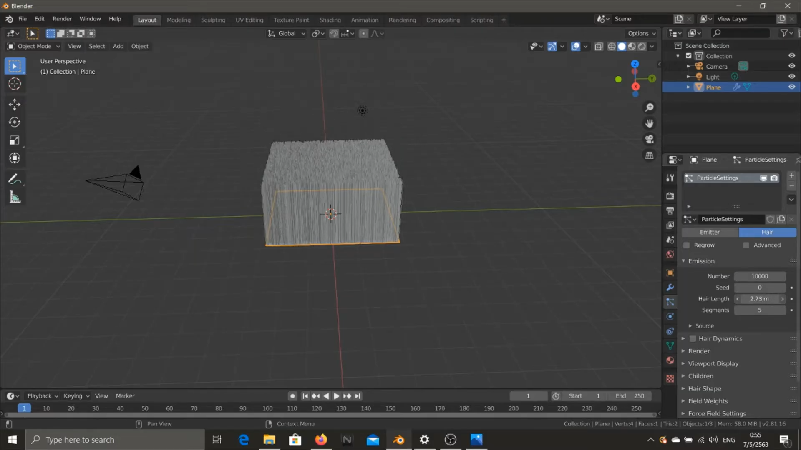
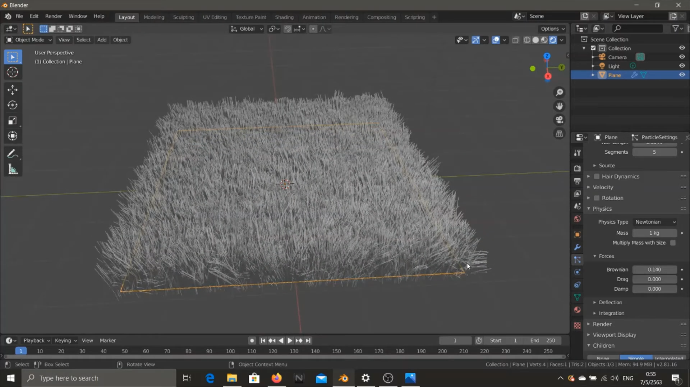
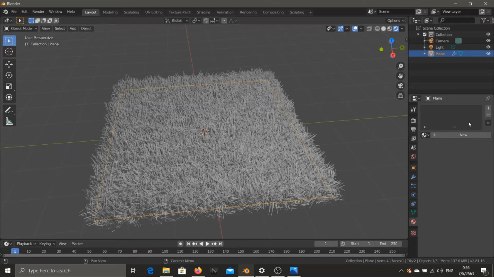
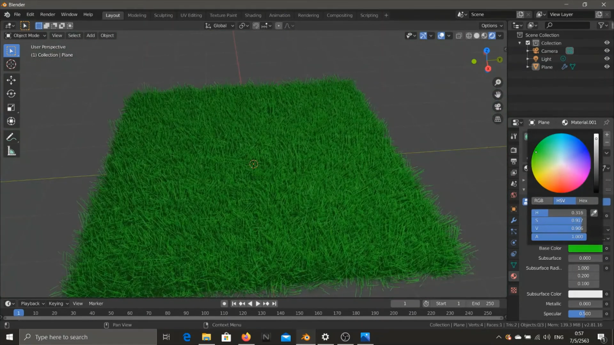

# การทำหญ้าแบบง่าย ๆ
&nbsp;&nbsp;&nbsp;&nbsp; เป็นการสอนการทำหญ้าบนพื้นดินสำหรับการประกอบฉากต่าง ๆ โดยใช้แถบเครื่องมือที่ชื่อว่า Paticle Properties
 
### Link สำหรับวิดีโอ
link video --> [Click Link](https://youtu.be/98Ko5OtQy14) 
 
 
 
 
 
</img>
 
[กลับสู่หน้าหลัก](README.md) 
