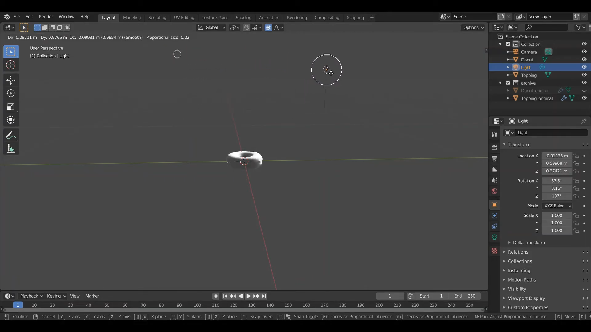
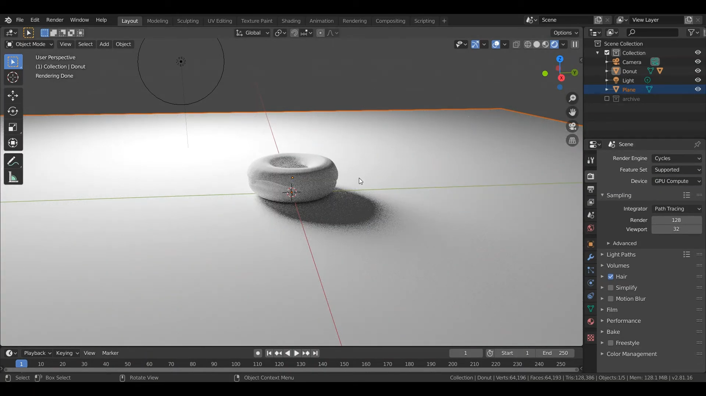
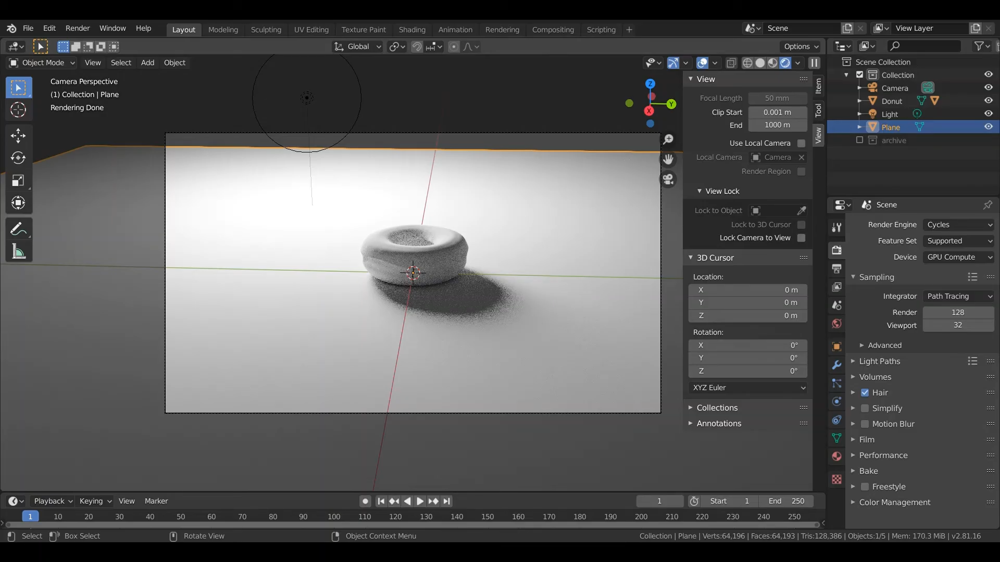
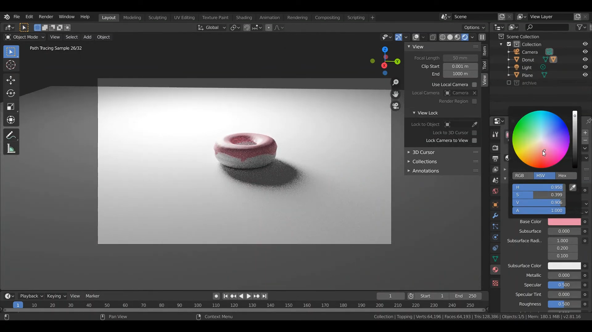
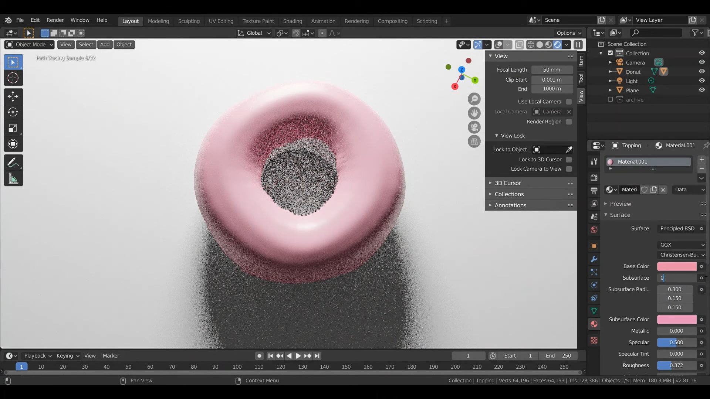
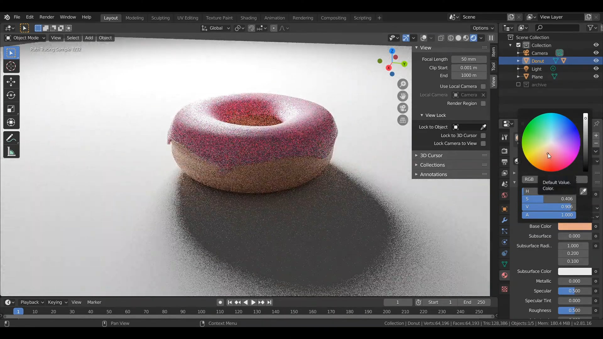
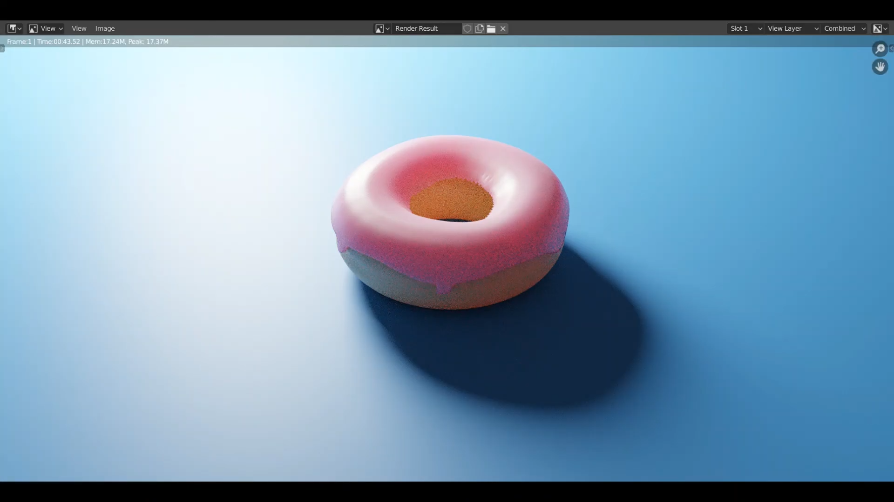

# การใส่ Lighting & Color
&nbsp;&nbsp;&nbsp;&nbsp; การจัดการกับแสง มุมกล้อง การกำหนดสีต่าง ๆ ให้กับ Object และการ Render Image ออกมาเป็นไฟล์รูปภาพ
 

### Link สำหรับวิดีโอ
link video --> [Click Link](https://youtu.be/lo8eb1wCzwQ) 
 
(1) ทำการเพิ่มกล้องและแสงไฟ โดยการกด Shift+A --> Light และ Shift+A --> Camera และทำการขยับด้วยการกด G และขยายขนาดด้วยการกด  S แล้วทำการขยับเมาส์  
 
 

(2) ทำการเพิ่มพื้นด้านล่างสำหรับวางโดนัทโดยการกด Shift+A --> Mesh --> Plane จากนั้นทำการเพิ่มขนาดหรือขยับ Object และทำการปรับการ render ภาพให้ใช้ GPU โดยไปที่เครื่องมือด้านขวาล่างเลือกแท็บ Render Properties เลือก Render Engine เป็น Cycle และ เลือก Device เป็น GPU Compute  
 
 

(3) ทำการกด Numpad0 (เลข 0 บนคีย์บอร์ด) จะเปลี่ยนมุมมองเป็นมุมมองของกล้องจากนั้นทำการปรับมุมมองกล้อง  
 
 

(4) ทำการกำหนดสีในส่วนของ Topping โดยไปที่เครื่องมือด้านขวาล่างเลือกแท็บ Materail Properties จากนั้นทำการเปลี่ยน Base color เป็นสีที่ต้องการ  
 
 

(5) ทำการปรับค่าต่าง ๆ เช่น Roughness , Subsurface , Subsurface Color ตามที่เราต้องการ  
 
 

(6) ทำการกำหนดสีให้กับแป้งโดนัท ทำเช่นเดียวกับข้อ (4)และ (5)  
 
 

(7) ทำการกด F12 เพื่อทำการ Render Image (ออกมาเป็นรูปภาพ)  
 
 
 
[กลับสู่หน้าหลัก](README.md) 

