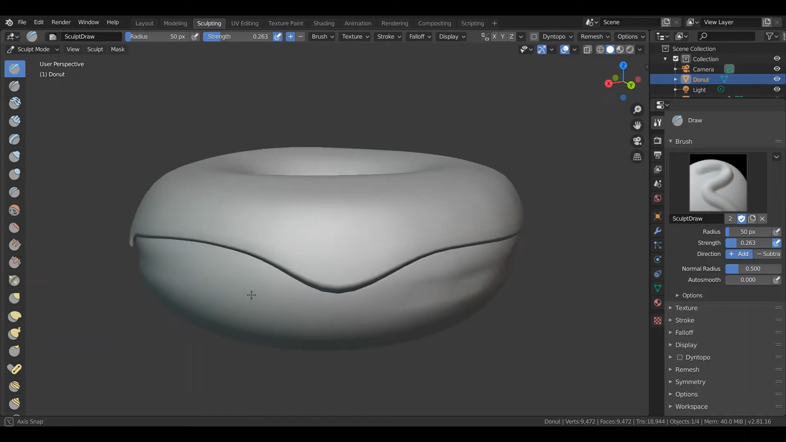
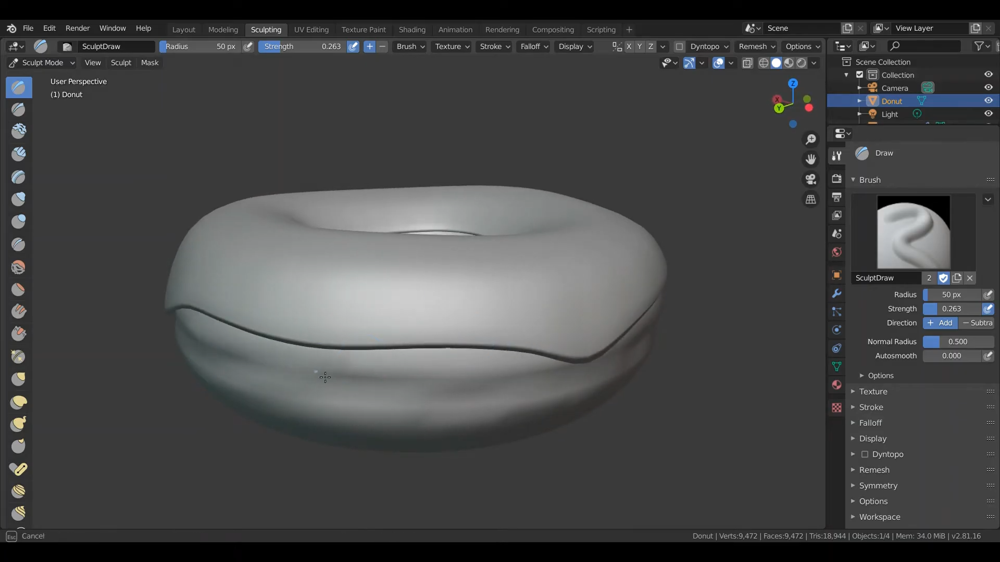
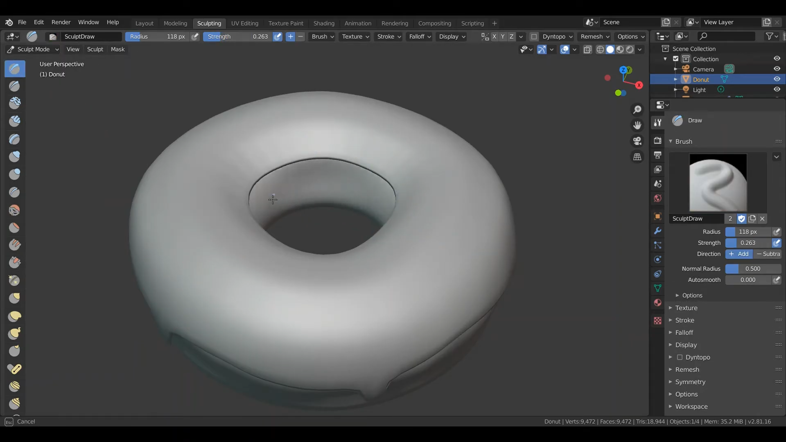
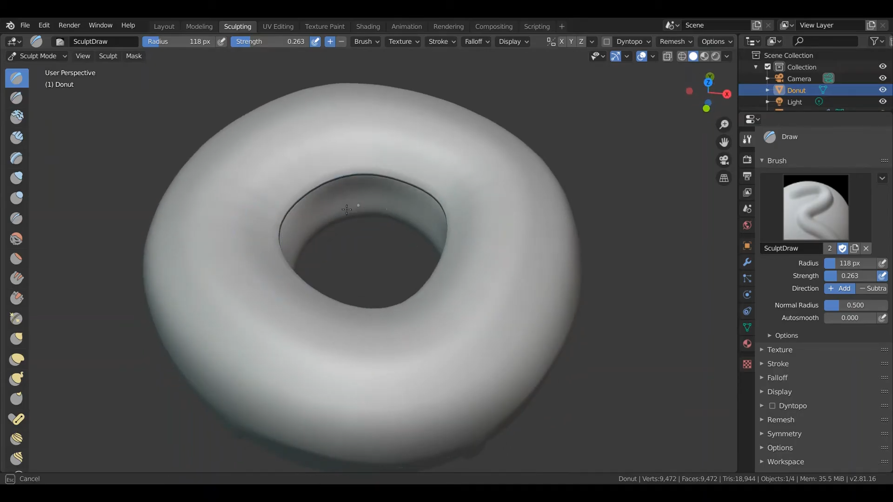
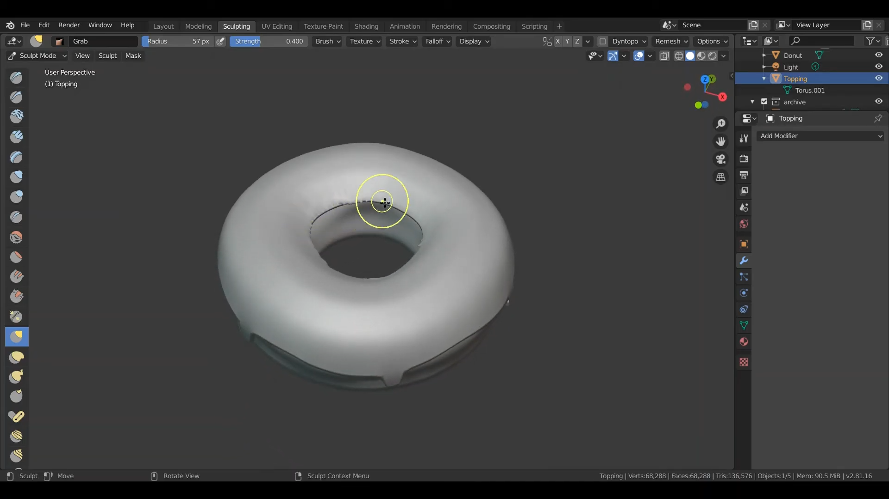

# การใส่ Materail
&nbsp;&nbsp;&nbsp;&nbsp; การปั้นรูปทรงให้มีความคล้ายคลึงกับโดนัท โดยมีรอยเหมือนน้ำตาลบนหน้า Topping ของโดนัทกำลังละลาย
 

### Link สำหรับวิดีโอ
link video --> [Click Link](https://youtu.be/UfYux36iJyU) 
 
(1) ทำในส่วนของ Topping ของโดนัทให้ดูเหมือนน้ำตาลบนโดนัทกำลังละลายลงมาโดยการกด E เพื่อดึง Egde บนโดนัทและกด G เพื่อขยับรูปทรงต่าง ๆ  
 
 

(2) ใช้ Mode Sculpting หรือโหมดการปั้นทำรอยด้านข้างของโดนัท  
 
 

(3) ทำเช่นเดียวกับในข้อ (2) แต่ทำในส่วนด้านใน ตรงกลางของโดนัท  
 
 

(4) ใช้เครื่องมือทำให้หน้าของโดนัทมีความเรียบหรือ smooth ขึ้น  
 
 

(5) เก็บรายละเอียดด้านในตรงกลางของโดนัทให้เหมือนน้ำตาลบนโดนัทกำลังละลายตรงกลางของโดนัทด้วย  
 
 
 
[กลับสู่หน้าหลัก](README.md) 
