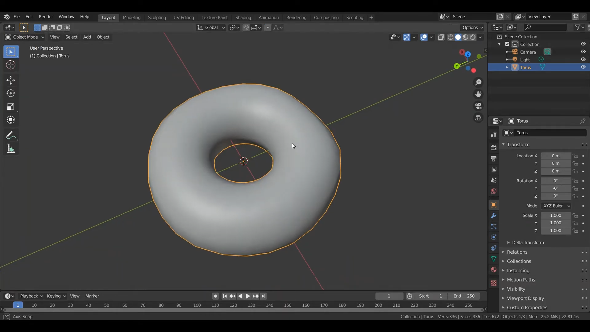

# การสร้าง Model
&nbsp;&nbsp;&nbsp;&nbsp; การสร้างโมเดลรูปทรงโดนัทโดยใช้โปรแกรม Blender 2.8 วิดีโอนี้เป็นการทำในส่วนของรูปทรงแป้งโดนัทและ Topping ด้านบน
 
### Link สำหรับวิดีโอ
link video --> [Click Link](https://youtu.be/9mXk0yO0uFM) 
 

(1) ทำการสร้าง object รูปทรงโดนัทโดยทำการกด shift+A --> Mesh --> Torus   
 
 

(2) จากนั้นทำการปรับค่าต่างๆ เช่น ขนาดของรูปทรง รัศมีวงกลม  
 
 

(3) ทำการปรับรูปร่างของโดนัทให้ดูสมจริง(ไม่กลมจนเกินไป) โดยไปที่ edit mode หรือเลือกไปที่ object แล้วกด Tab จากนั้นเลือกจุดต่าง ๆ บน object แล้วกด G เพื่อปรับรูปร่าง  
 
 

(4) ทำการเลือกที่ object แล้วทำการคลิกขวาเลือก shade smooth เพื่อให้ได้รูปทรงที่ smooth ขึ้น  
 
 

(5) ทำในส่วนของ Topping ด้านบน โดยการเลือกส่วนที่เราต้องการจะทำเป็น Toping (Edit mode) จากนั้นทำการกด Shift+D เพือ copy object  
 
 

(6) นำส่วนที่เป็น topping ที่ copy ในข้อ (6) มาวางบนสุดของโดนัท  
 
 

(7) จะได้รูปทรงโดนัทที่แบ่งเป็น 2 ส่วน คือส่วนแป้งขนมปังและส่วนที่เป็น Topping  
 
 
 
[กลับสู่หน้าหลัก](README.md) 

