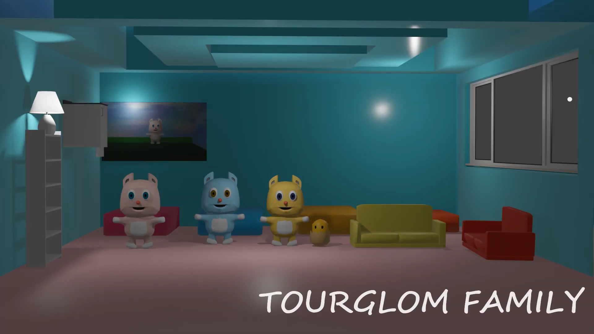
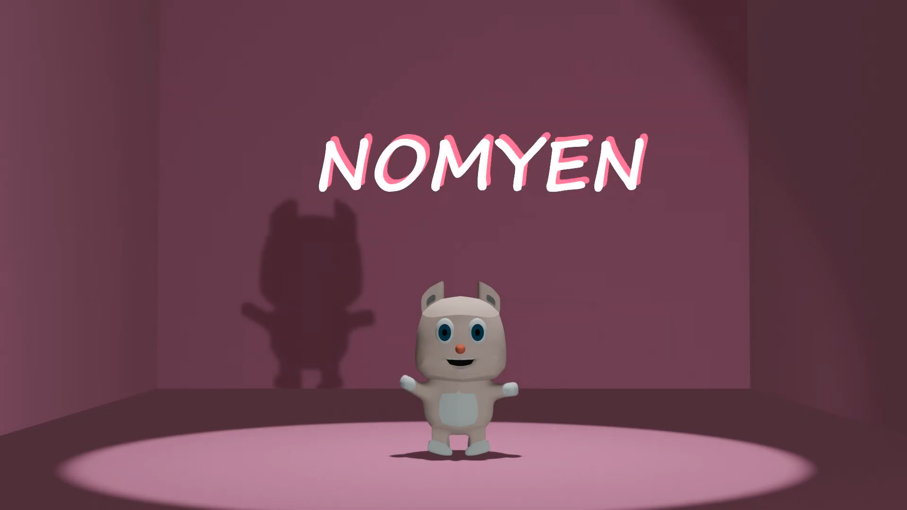
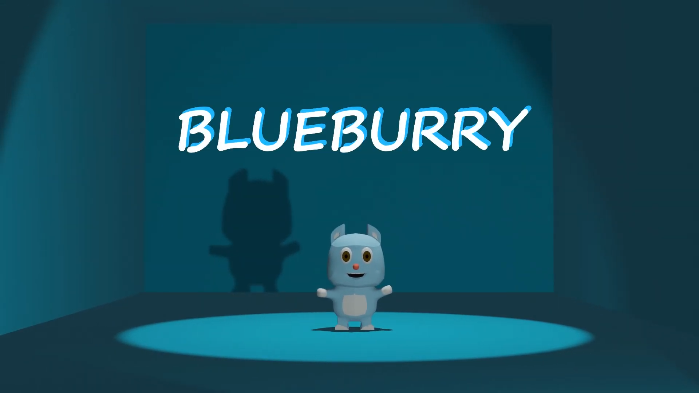
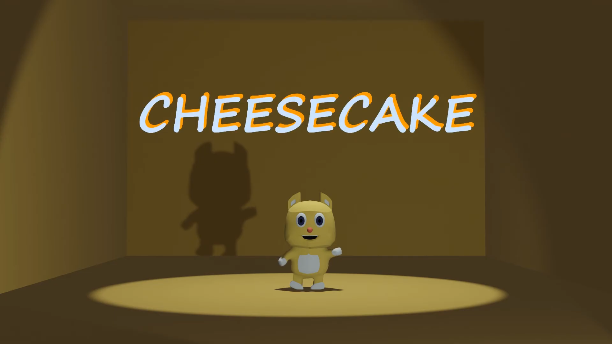
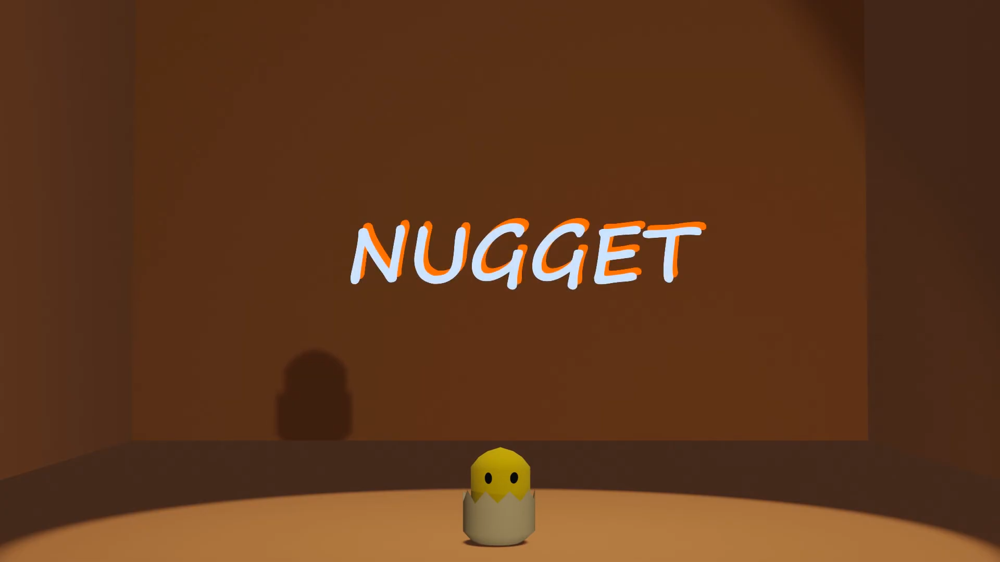
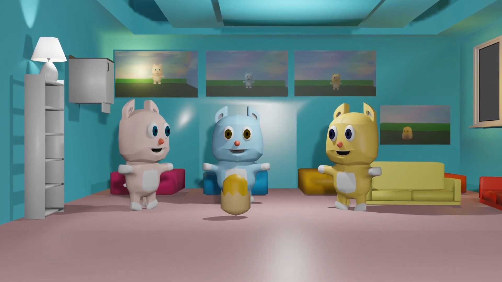
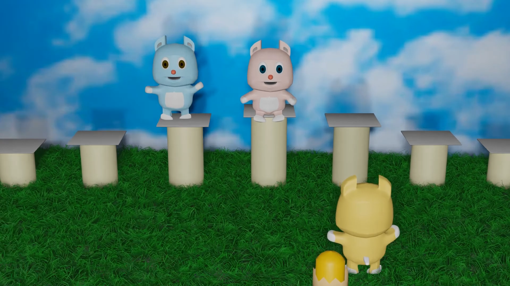
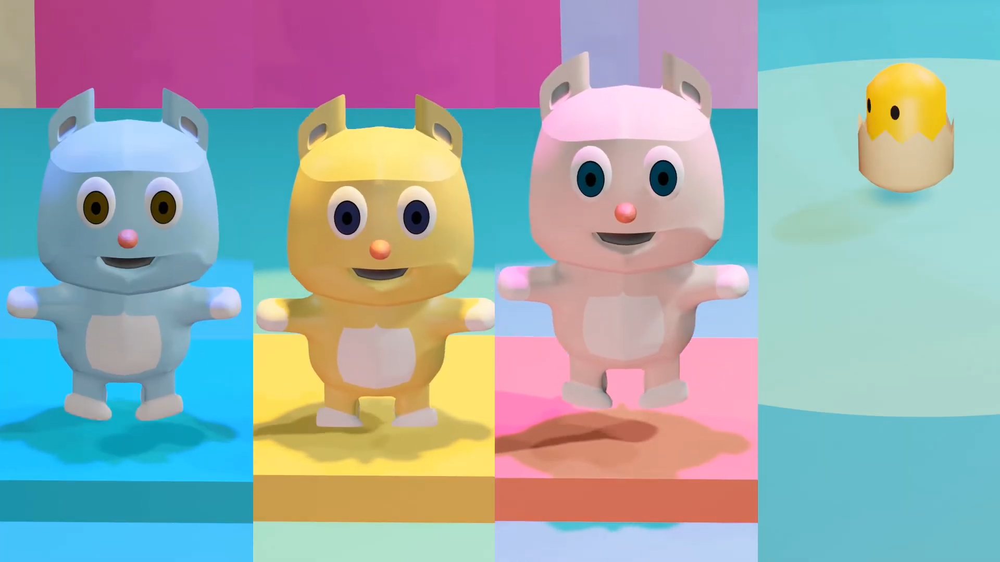

# Final Project
&nbsp;&nbsp;&nbsp;&nbsp; เป็นอนิเมชั่นสั้น ๆ ตอนครอบครัวตัวกลมกับโลกดนตรี เป็นเรื่องราวของตัวละครทั้ง 4 ตัวที่หลุดเข้าไปในโลกของดนตรี โดยอนิเมชั่นที่ทำขึ้นได้นำความรู้ที่ได้จากการเรียนวิชา CN409 มาใช้ประกอบกับการหาข้อมูลจากอินเทอร์เน็ต โดยอนิเมชั่นที่ทำจะมีการสร้างโมเดลตัวละคร การเซตฉากต่าง ๆ การทำให้ตัวละครเคลื่อนไหว การเล่นกับแสงสี ไฟ และกล้อง และการตัดต่อวิดีโอต่าง ๆ สามารถรับชมเรื่องราวความสนุกได้จากลิง์วิดีโอด้านล่างค่ะ 
 
### Link สำหรับวิดีโอ
link video --> [Click Link](https://youtu.be/OyZQZT3nxxk) 
 

 
</img>
 
## ตัวละคร 
&nbsp;&nbsp;&nbsp;&nbsp; ประกอบไปด้วยโมเดลตัวละครทั้งหมด 4 ตัว คือ นมเย็น , บลูเบอร์รี่ , ชีสเค้ก และนักเก็ต  
 
 
 
 
 
 

## ฉาก
&nbsp;&nbsp;&nbsp;&nbsp; ประกอบไปด้วยฉากทั้งหมด 3 คือ ฉากภายในบ้าน , ฉากในสวน และฉากโลกดนตรี โดยในฉากขะประกอบไปด้วยโมเดลต่าง ๆ ที่เป็นเฟอร์นิเจอร์ เช่น พุ่มไม้ , หญ้า , เตียงนอน , โซฟา , รูปภาพติดผนัง เป็นต้น
(1) ฉากภายในบ้าน  
 
 
 
(2) ฉากในสวน  
 
 
 
(3) ฉากโลกดนตรี  
 
 

 
[กลับสู่หน้าหลัก](README.md) 
