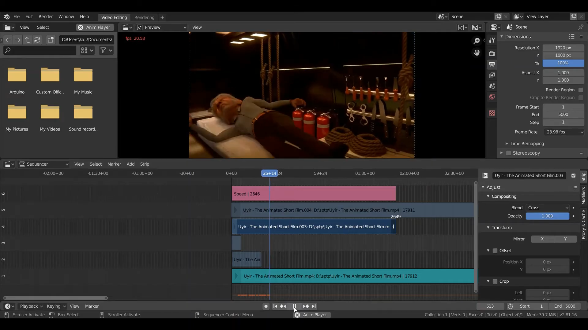
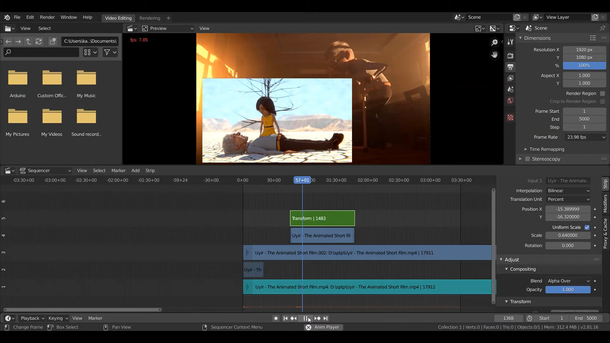
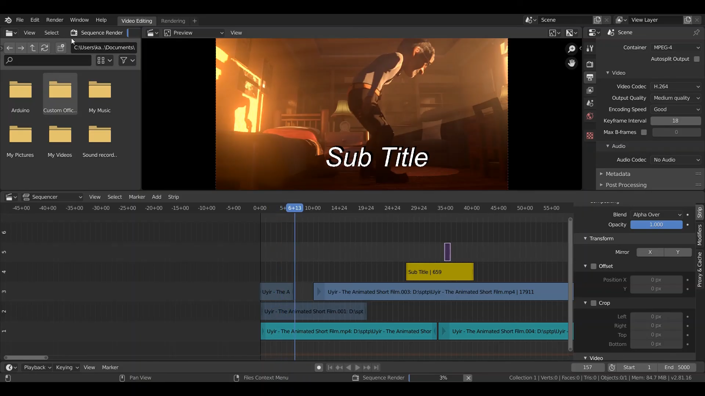
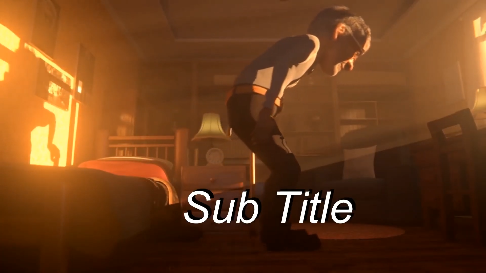

# Video Editor
&nbsp;&nbsp;&nbsp;&nbsp; การตัดต่อวิดีโอโดยใช้ video editing ด้วยโปรแกรม Blender 2.8
 
### Link สำหรับวิดีโอ
link video --> [Click Link](https://youtu.be/draYSh34c0o) 
 

- การปรับ speed ให้กับ Video  
 
 

- การทำภาพซ้อนกัน  
 
 

- การใส่ข้อความบน Video  
 
 

- ทำการตั้งค่าการ Render เป็น Video โดยไปที่หน้าต่างเครื่องมือด้านบนขวาเลือกไปที่แท็บ Output Properties เลื่อนหาไปที่หัวข้อ Output จากนั้นทำการเลือก Path ที่ต้องการให้ Video Save ลงจากนั้นเลือก File format เป็น FFmpeg video จากนั้นดูไปที่หัวข้อ Encoding จากนั้นดูไปที่ Container เลือกเป็น MPEG-4 (ให้บันทึกไฟล์เป็นสกุล .mp4) จากนั้นทำการ Render Video โดยกด Ctrl+F12  
 
 
 
</img>
[กลับสู่หน้าหลัก](README.md) 
