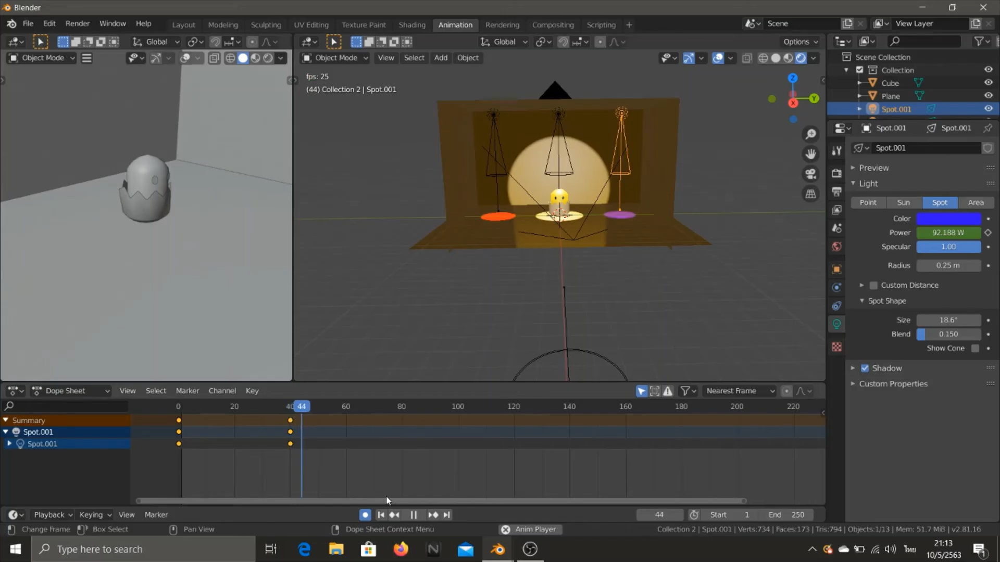
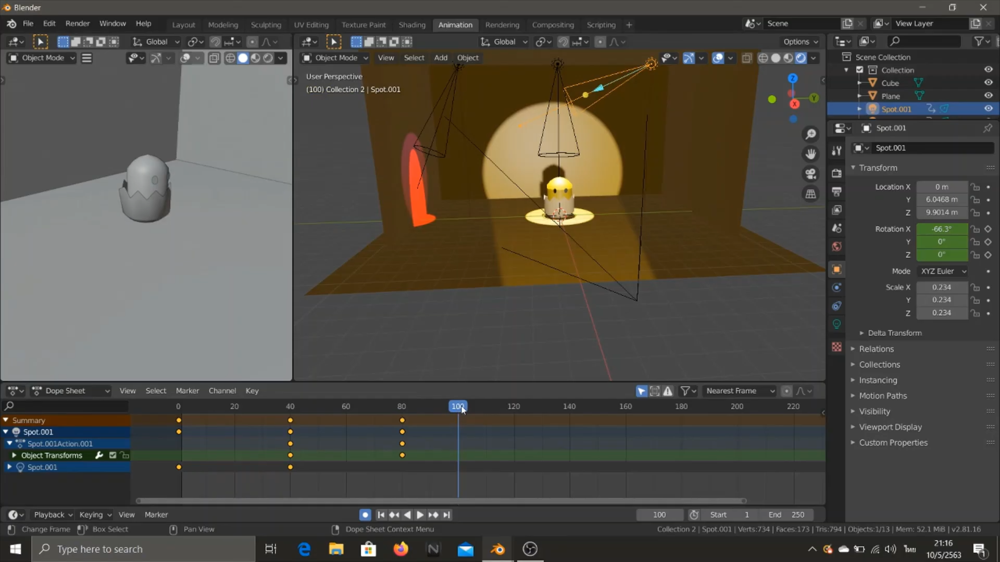

# การเซตฉากเปิดตัว VTR
&nbsp;&nbsp;&nbsp;&nbsp; การสร้างฉากสำหรับเป็นฉาก VTR เปิดตัวตัวละคร โดยมีการเล่นกับแสงไฟ และกล้อง และการเคลื่อนไหวของแสงสีและกล้อง ให้คล้ายกับการเซตฉากบนเวทีเมื่อซูมกล้องเข้าใกล้ตัวละครไปเรื่อยๆ ไฟจะค่อย ๆ สว่างขึ้น จากนั้นจะใช้ไฟสีต่าง ๆ ขยับไปมาให้เหมือนไฟ spot ligth สีต่างๆที่ฉายไปมา 
 
### Link สำหรับวิดีโอ
link video --> [Click Link](https://www.youtube.com/watch?v=WDECXT1AhuU) 
 
 
 
 
</img>
 
[กลับสู่หน้าหลัก](README.md) 
